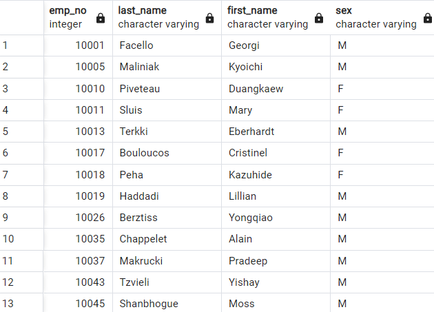
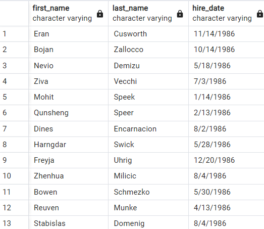
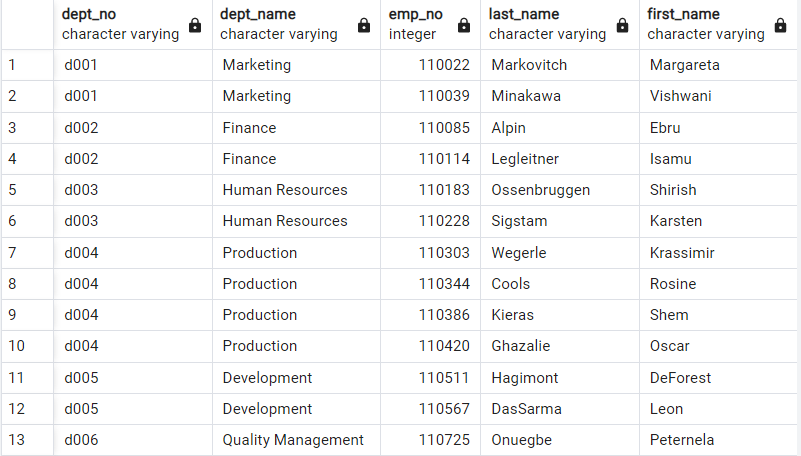
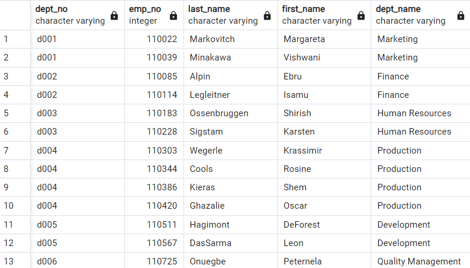
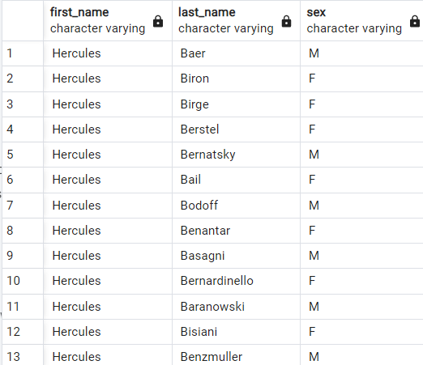
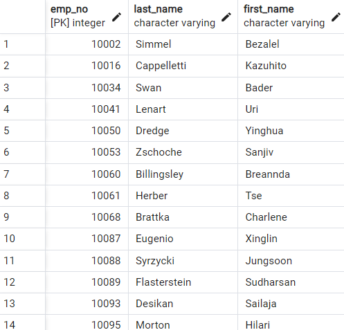
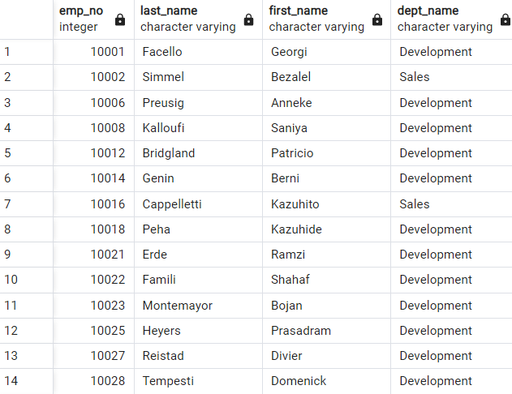
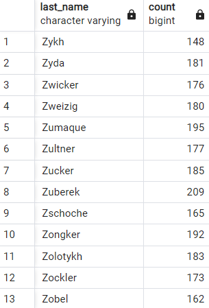

# sql-challenge
Module 9 SQL challenge for the Vanderbilt Data Analytics Bootcamp

# Schema
We have the following schema for the given `csv` files. 


```
CREATE TABLE departments (
    dept_no VARCHAR NOT NULL PRIMARY KEY,
    dept_name VARCHAR
);

CREATE TABLE employees (
    emp_no INT NOT NULL PRIMARY KEY,
    emp_title VARCHAR,
    birth_date VARCHAR,
    first_name VARCHAR,
    last_name VARCHAR,
    sex VARCHAR,
    hire_date VARCHAR
);

CREATE TABLE dept_emp (
    emp_no INT NOT NULL,
    dept_no VARCHAR NOT NULL,
    FOREIGN KEY (emp_no) REFERENCES employees(emp_no),
    FOREIGN KEY (dept_no) REFERENCES departments(dept_no)
);

CREATE TABLE dept_manager(
    dept_no VARCHAR NOT NULL,
    emp_no INT NOT NULL,
    FOREIGN KEY (dept_no) REFERENCES departments(dept_no),
    FOREIGN KEY (emp_no) REFERENCES employees(emp_no)
);

CREATE TABLE salaries (
    emp_no INT,
    salary INT,
    FOREIGN KEY (emp_no) REFERENCES employees(emp_no)
);

CREATE TABLE titles (
    title_id VARCHAR NOT NULL PRIMARY KEY,
    title VARCHAR
);
```
# Analysis
## 1. Employee info
```
SELECT e.emp_no, last_name, first_name, sex, salary
FROM employees AS e
INNER JOIN salaries ON e.emp_no = salaries.emp_no;
```


## 2. Employees hired in 1986
```
SELECT first_name, last_name, hire_date
FROM employees
WHERE hire_date LIKE '%86';
```


## 3. Department managers
```
SELECT d.dept_no, dept.dept_name, d.emp_no, e.last_name, e.first_name
FROM dept_manager AS d
INNER JOIN employees AS e ON d.emp_no = e.emp_no
INNER JOIN departments AS dept ON d.dept_no = dept.dept_no
```


## 4. Employee Departments
```
SELECT d.dept_no, e.emp_no, e.last_name, e.first_name, d.dept_name
FROM employees AS e
INNER JOIN dept_manager ON e.emp_no = dept_manager.emp_no
INNER JOIN departments AS d ON dept_manager.dept_no = d.dept_no
```


## 5. Employees Named Hercules B...
```
SELECT first_name, last_name, sex
FROM employees
WHERE first_name = 'Hercules'
AND last_name LIKE 'B%'
```


## 6. Employees in Sales
```
SELECT e.emp_no, last_name, first_name
FROM employees AS e
INNER JOIN dept_emp ON e.emp_no = dept_emp.emp_no
INNER JOIN departments ON dept_emp.dept_no = departments.dept_no
WHERE dept_name = 'Sales'
```


## 7. Employees in Sales and Development
```
SELECT e.emp_no, e.last_name, e.first_name, dept_name
FROM employees AS e
INNER JOIN dept_emp ON e.emp_no = dept_emp.emp_no
INNER JOIN departments ON dept_emp.dept_no = departments.dept_no
WHERE dept_name = 'Sales' OR dept_name = 'Development'
```


## 8. How Many Employees Share Each Last Name
```
SELECT last_name, COUNT(last_name)
FROM employees
GROUP BY last_name
	ORDER BY last_name DESC
```
